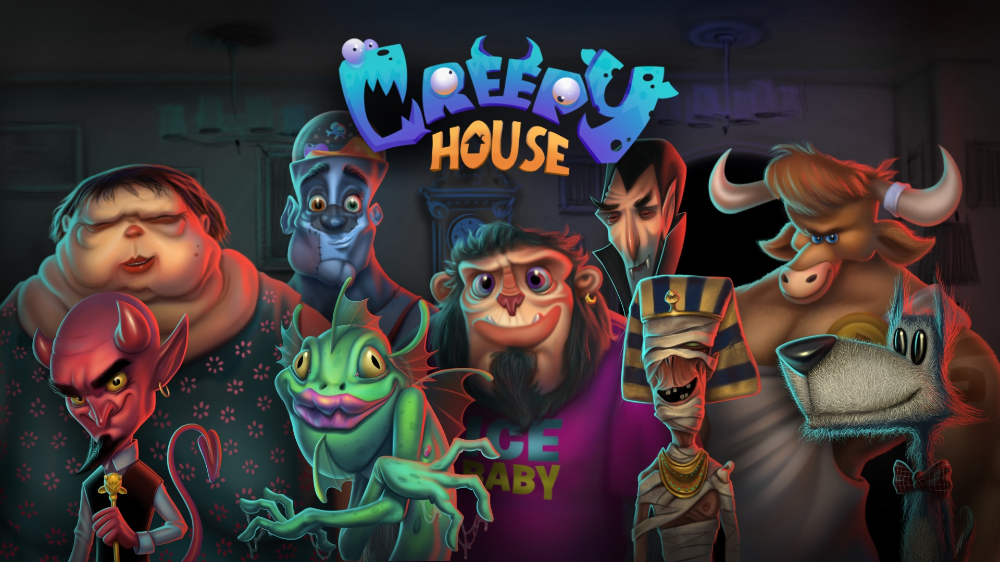

<center></center>

# Creepy House

Your __home__ is the best place to invite your M̶̴̮͎̦͉̲͙̣̟Ơ̷͎̗̥͜Ń̵̛̛͔̳͚̜͍̥͝S̕҉̶̸͈͔̪̘̝͕̞͔̪͙͔̝T͏̸̡͚̗̬͓͔̝̟̠͠È̗̳̥̼̹̘͇̤̙̞͎̺͔́͜͞͞ͅR̶̷͓̜̜̟͍̥̀́     &nbsp; friends over for a wicker party.  
Trouble is, you've just conveniently been afflicted with _amnesia_ and now you don't know __who's__ coming and what their favorite __drink__ is.  
Your friends will help you with stating what their poison of choice, but after that you're on your own!  

Make sure to keep them satisfied 'til __dawn__ to win the game.

## How to play
Your friends will show up one by one asking for their favorite drinks. Double click on one of them in the bar to serve. The first time you see them, they will __state__ what their favorite drinks are (starting with __5__). Get it right and they will remind you next time, except it will be __4__ drinks now, and so on. Get it wrong and they will be less than happy, keep that up and they will just __leave__!

[PLAY NOW](https://haykokoryun.github.io/Creepy-House/index.html)

## Project setup
```
yarn install
```

### Compiles and hot-reloads for development
```
yarn run serve
```

### Compiles and minifies for production
```
yarn run build
```
